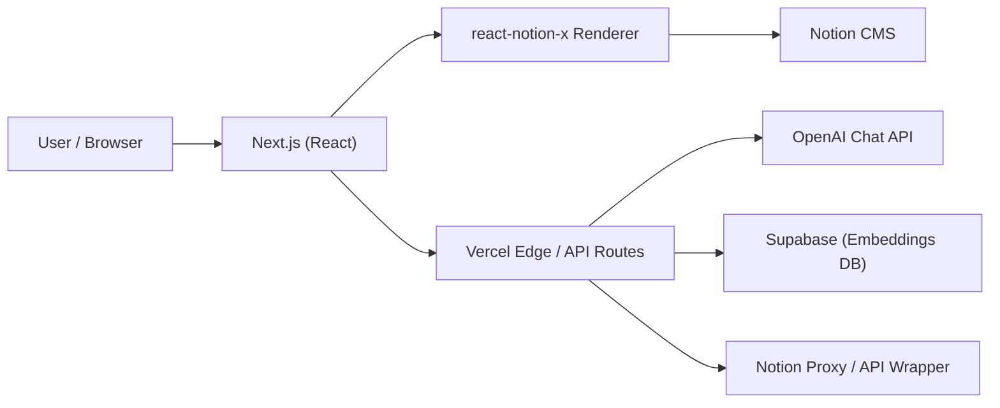
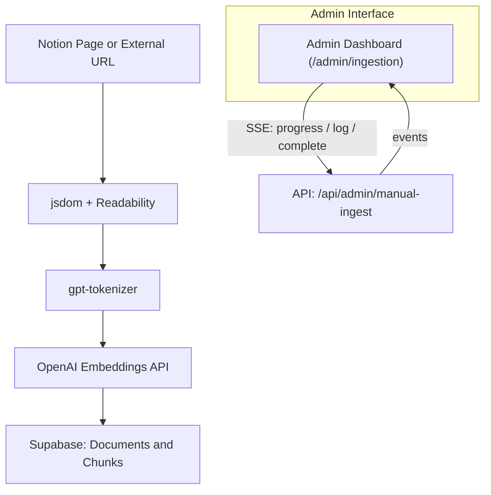

## 🧾 ${{ github.ref_name }} — Release Notes

> The first structured release of the customized **Next.js + Notion Portfolio Framework**,  
> rebuilt from the original [Next.js Notion Starter Kit](https://github.com/transitive-bullshit/nextjs-notion-starter-kit).
>
> This release establishes a full foundation for **RAG ingestion**, **Chat Assistant**, and **Admin workflows**,  
> while introducing refined UI/UX and production-ready configurations.

---

### 🚀 Highlights

#### 🧱 Hybrid SSG + Serverless

- Next.js + React + Vercel Edge runtime
- Incremental Static Regeneration (ISR) for fast, dynamic content
- Dynamic Notion rendering with `react-notion-x`
- Configurable caching via `NOTION_PAGE_CACHE_TTL`

#### 🧩 RAG + Admin Ingestion + Chat Assistant

- End-to-end ingestion pipeline (manual + batch modes)
- SSE-powered progress updates via `/admin/ingestion`
- Embeddings with **OpenAI** → stored in **Supabase**
- Chat Assistant with streaming responses via Edge API (`/api/chat`)

#### 💅 UI/UX Enhancements

- ✨ **SidePeek Panel** — animated drawer for contextual navigation
- 📊 **Mermaid Diagram Rendering** — visual flowcharts embedded in Notion blocks
- 🧭 **Footer & Layout Redesign** — cleaner typography and responsive layout
- 🎨 Custom **Notion CSS overrides** for readability, spacing, and dark-mode balance
- 📱 Improved mobile responsiveness and code-block styling

---

### 🧠 Architecture

#### 🌐 Web Request Flow





---

### ⚙️ Configuration

```
ADMIN_DASH_USER=
ADMIN_DASH_PASS=
NOTION_PAGE_CACHE_TTL=
OPENAI_API_KEY=
SUPABASE_URL=
SUPABASE_SERVICE_KEY=
```

---

### 🧩 Dependencies

- OpenAI SDK, Supabase JS, gpt-tokenizer
- @mozilla/readability, jsdom, exponential-backoff
- framer-motion, react-modal, @react-icons/all-files

---

### 🧠 Credits

- **Base Project:** Next.js Notion Starter Kit
- **Author:** Jack Park
- **Hosting:** Vercel
- **CMS:** Notion

---

> 🏷️ **Tag:** `${{ github.ref_name }}`  
> ⚙️ **Status:** Pre-release or Stable (update as appropriate)  
> 🗓️ **Date:** ${{ github.event.release.published_at }}
