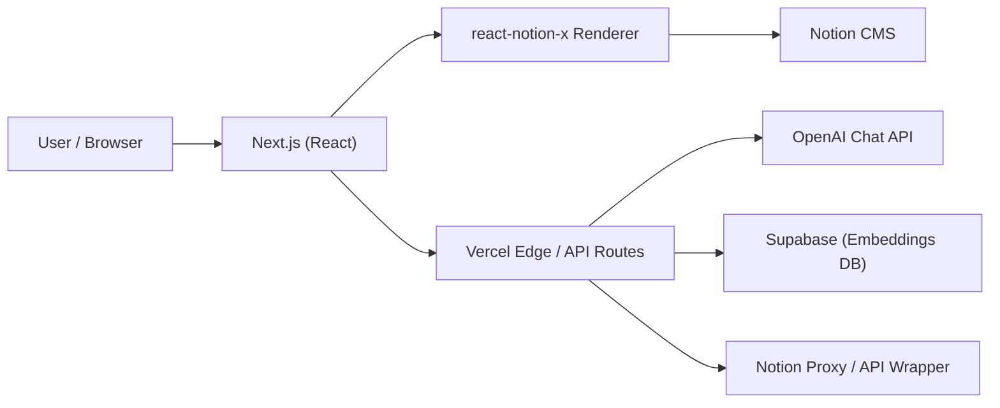
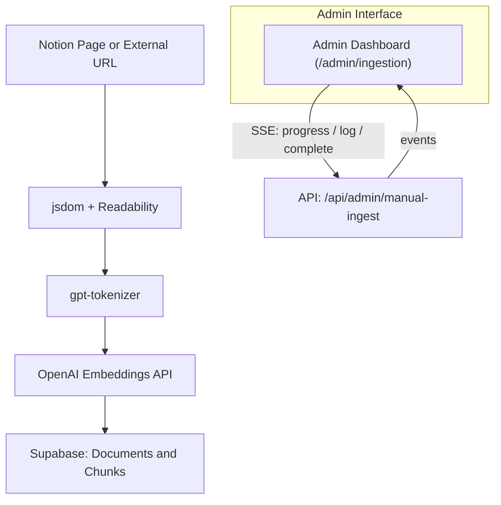

# Next.js + Notion Portfolio Framework


> A customized evolution of the [Next.js Notion Starter Kit](https://github.com/transitive-bullshit/nextjs-notion-starter-kit), rebuilt for an **AI-integrated personal portfolio website** featuring Notion CMS, RAG ingestion, and an Edge-based Chat Assistant.

---

## 🚀 Features

### 🧱 Hybrid SSG + Serverless

- Built with **Next.js + React**, deployed on **Vercel Edge Runtime**
- Supports **Incremental Static Regeneration (ISR)** for fast yet dynamic content
- Dynamic Notion rendering powered by **react-notion-x**

### 🧩 RAG + Admin Ingestion + Chat Assistant

- End-to-end document ingestion pipeline (manual + batch modes)
- Semantic embeddings via **OpenAI** stored in **Supabase**
- `/admin/ingestion` dashboard with real-time progress (SSE streaming)
- Built-in **Chat Assistant** with a floating panel UI and streaming responses

### 🎨 Enhanced UI/UX

- Custom **Notion CSS overrides** for better readability and layout control
- Integrated **Mermaid diagram** rendering
- **SidePeek** panel animations for smoother navigation
- SEO-optimized meta tags and Open Graph previews

---

## ⚙️ Setup

1. **Clone and install**

   ```bash
   git clone https://github.com/jack-h-park/nextjs-react-notion-x
   cd nextjs-react-notion-x
   pnpm install
   ```

2. **Configure environment variables**
   Create a `.env.local` file:

   ```bash
   ADMIN_DASH_USER=admin
   ADMIN_DASH_PASS=secret
   NOTION_PAGE_CACHE_TTL=300

   OPENAI_API_KEY=sk-...
   SUPABASE_URL=https://your-project.supabase.co
   SUPABASE_SERVICE_ROLE_KEY=...
   ```

3. **Prepare Supabase chat settings table**

   ```sql
   create table if not exists chat_settings (
     key text primary key,
     value text not null,
     updated_at timestamptz not null default timezone('utc', now())
   );
   ```

   > The admin dashboard (`/admin/chat-config`) reads and updates the shared system prompt from this table.

4. **Run locally**

   ```bash
   pnpm dev
   ```

5. **Deploy to Vercel**
   ```bash
   pnpm run deploy
   ```

---

## 🧭 Architecture

### 🌐 Web Request Flow



### ⚙️ Ingestion & RAG Pipeline



---

## 🧩 Dependencies

- **OpenAI SDK**, **Supabase JS**, **gpt-tokenizer**
- **@mozilla/readability**, **jsdom**, **exponential-backoff**
- **framer-motion**, **react-modal**, **@react-icons/all-files**

---

## 🧠 Credits

- **Base Project:** [Next.js Notion Starter Kit](https://github.com/transitive-bullshit/nextjs-notion-starter-kit)
- **Author:** Jack H. Park
- **Hosting:** [Vercel](https://vercel.com)
- **CMS:** [Notion](https://www.notion.so)

---

> _v0.1.0 — Initial Structured Release_  
> The first structured, feature-complete iteration with RAG ingestion, chat assistant, and admin UI.
